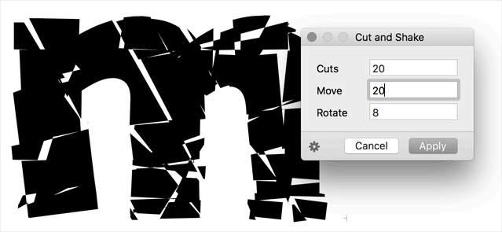

# CutAndShake.glyphsFilter

This is a plugin for the [Glyphs font editor](http://glyphsapp.com/) by Georg Seifert.
It exercises cuts across selected glyphs, and then both moves and rotates the resulting parts by random amounts, for which the user can specify maximums. After installation, it will add the menu item *Filter > Cut and Shake*. You can set a keyboard shortcut in System Preferences.

### Installation

1. Download the complete ZIP file and unpack it, or clone the repository.
2. Double click the .glyphsFilter file. Confirm the dialog that appears in Glyphs.
3. Restart Glyphs

### Usage Instructions

1. Open a glyph in Edit View, or select any number of glyphs in Font or Edit View.
2. Use *Filter > Cut and Shake* to bring up the dialog and apply the effect on all selected glyphs.

Alternatively, you can also use it as a custom parameter in an instance:

	Property: Filter
	Value: GlyphsFilterCutAndShake;<Number of cuts>;<maximum move in units>;<maximum rotation in degrees>;

If you do not feel like typing it, you can click the *Copy Parameter* button, which puts the custom parameter with the current dialog settings in the clipboard. You can then paste it into an instance parameter field.

### Requirements

The plugin needs Glyphs 1.4.3 or higher, running on OS X 10.7 or later. I can only test it in current OS versions, and I assume it will not work in versions of Mac OS X older than 10.7.

### License

Copyright 2014 Rainer Erich Scheichelbauer (@mekkablue).
Based on sample code by Georg Seifert (@schriftgestalt).

Licensed under the Apache License, Version 2.0 (the "License");
you may not use this file except in compliance with the License.
You may obtain a copy of the License at

http://www.apache.org/licenses/LICENSE-2.0

See the License file included in this repository for further details.
